# <u>**Supply Chain & Digital Behavior Analysis**</u>
**End-to-End Analytics Project Documentation**
* **By:** **Jeet Sarkar**
* **Tools:** SQL (PostgreSQL), Excel, Power BI
* **Dataset Credit:** Mendeley Data — *Supply Chain Data by DataCo Global*

## **Project Overview**

This project delivers an end-to-end analytical assessment that integrates **Digital Demand Signals** (web traffic and user engagement) 
with **Supply Chain Fulfilment Metrics** (sales, profitability, and logistics risk). 
The objective was to generate actionable operational and strategic insights that mirror real-world business analytics workflows.
The analysis leverages:
*	**SQL** for robust data cleaning, transformation, and analytical modelling
*	**Excel** for exploratory analysis and rapid prototyping using Pivot Tables
*	**Power BI** for enterprise-grade data modelling and executive dashboards
The project follows a structured analytics lifecycle commonly adopted in business environments:
*	**Business Requirement Understanding**
*	**Data Preprocessing & Cleaning (SQL)**
*	**Intermediate Analysis & Prototyping (Excel)**
*	**Data Modelling & Dashboard Development (Power BI)**
*	**Insights, Interpretation, and Recommendations**

## **Tools and Their Purpose**

|**Tool**|**Purpose**|
| :--- | ---: |
|**Excel**|Rapid data validation, exploratory analysis, interactive Pivot Tables, and advanced reporting through dynamic conditional formatting techniques.|
|**PostgreSQL**|Database schema creation, extensive data cleaning and transformation, complex analytical queries, and creation of optimized SQL Views for BI consumption.|
|**Power BI**|Development of DAX measures (e.g., Total Sales, Total Views, Late Delivery Rate) and construction of multi-visual, business-focused dashboards.|

## <u>**Stage 1 – Business Requirement Understanding**</u>

**Key Business Questions Addressed**

|**Analysis Area**|**Key Questions**|
| :--- | ---: |
|**Sales & Profitability**|What are the Total Sales and Total Profit? How is profit distributed across customer segments? Which products are high-volume but low-margin?|
|**Digital Demand**|What are the monthly traffic trends? When does demand peak during the day? Which products and categories attract the highest interest?|
|**Logistics Risk**|Which regions exhibit the highest late delivery risk? Which customer segments contribute most to profit exposure due to delivery delays?|

## <u>**Stage 2 – Data Cleaning & SQL View Creation**</u>

All critical data preparation was performed in PostgreSQL to ensure analytical reliability.

|**Tool**|**Step**|**Description**|
| :---| ---: |
|**SQL**|Date & Time Standardization|Converted all date/time fields (Order Date, Shipping Date, Log Dates) from text/object formats to standardized DATETIME types.|
|**SQL**|Missing & Null Value Handling|Identified high-impact missing fields (e.g., Customer Zipcode, Customer Last Name). Applied appropriate strategies such as categorical placeholders or exclusion from financial calculations.|
|**SQL**|Product Name Standardization|Cleaned and normalized product identifiers across transactional and log datasets (lowercasing, trimming, removing special characters) to maximize join accuracy in Power BI.|
|**SQL**|Analysis-Ready Views|Created clean, optimized SQL Views for supply chain data and digital log data, serving as the single source of truth for Power BI modelling.|

*Data Cleaning & Transformation*
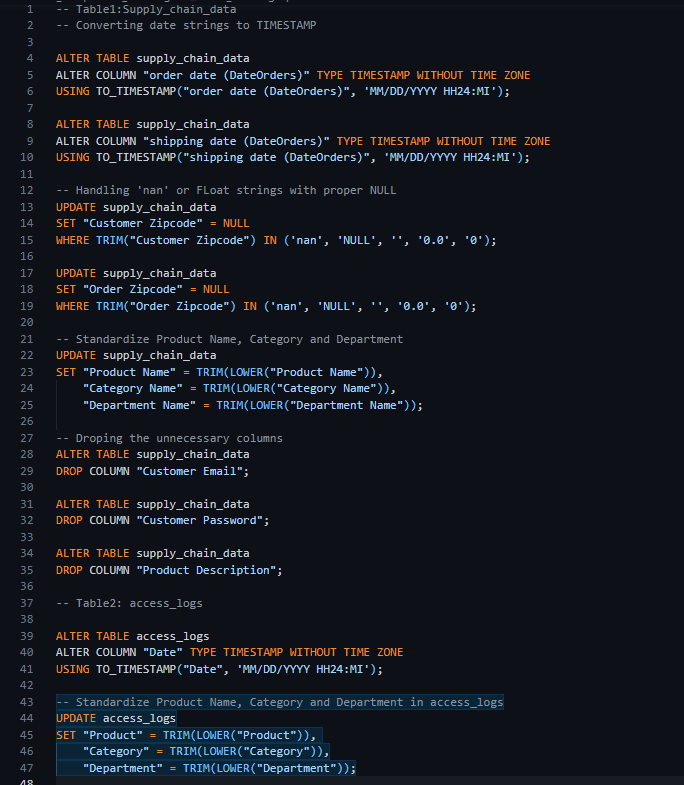

*Views*
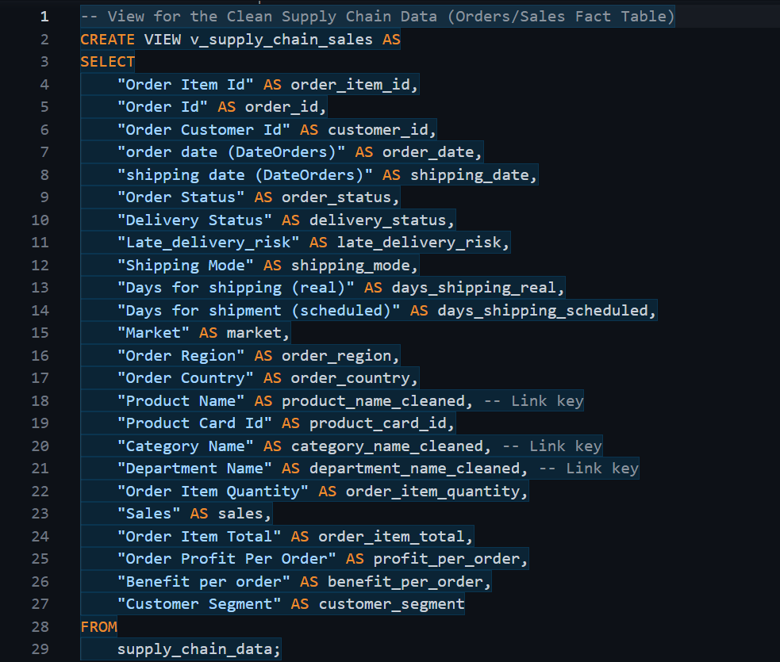

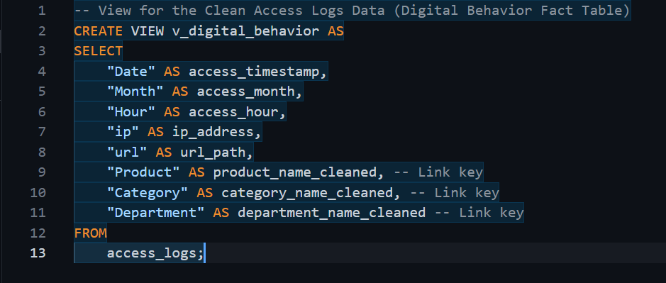

## <u>**Stage 3 – Core Supply Chain & Digital Behavior Analysis**</u>

*(SQL & Excel)*
**Supply Chain Analysis**

|**Tool**|**Step**|**Focus Area**|**Deliverable**|
| :--- | :---: | :---: | ---: |
|**SQL**|KPI Calculation|Total Revenue, Total Profit, Average Profit per Order, Late Delivery Rate|KPI Summary|
|**SQL**|Profitability Analysis|Profit and sales by Category, Department, and Market; Top/Bottom 5 performers|Profitability Tables|
|**SQL**|Logistics Risk Analysis|Late Delivery Risk (%) by Shipping Mode and Order Region|Risk Analysis Table|
|**Excel**|Pivot Deep Dive|Interactive analysis of Profit by Customer Segment, State, and Month|Excel Pivot Analysis|

*KPI Calculation*
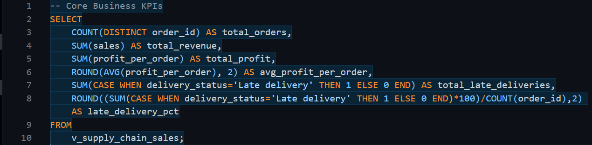

*Profitability Analysis*
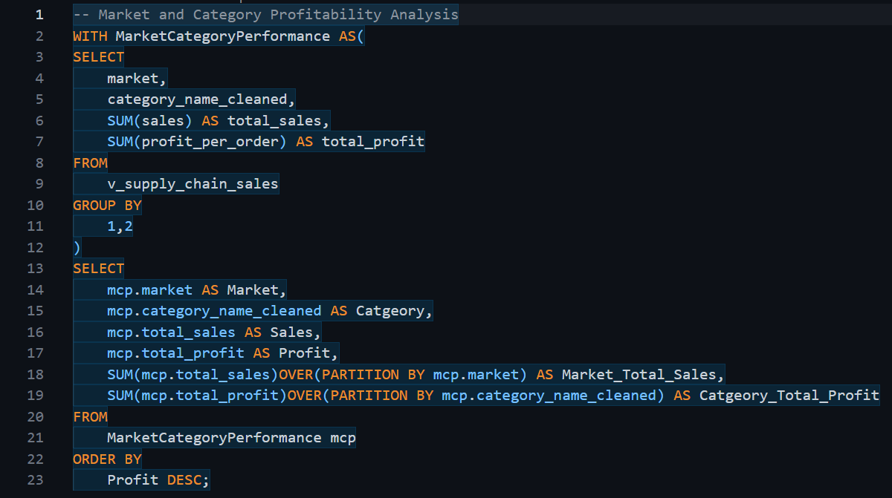

*Logistics Risk Analysis*
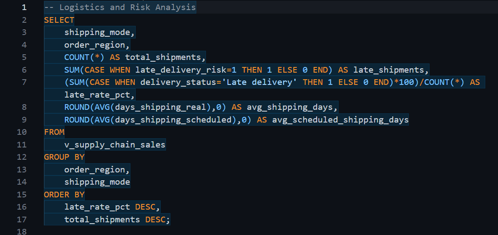

*Sales Trend Analysis*
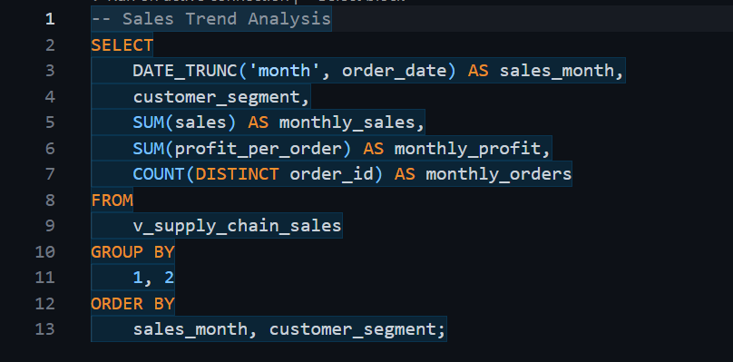

*Pivot Tables Overview*

*Sales Trend Pivot Table*
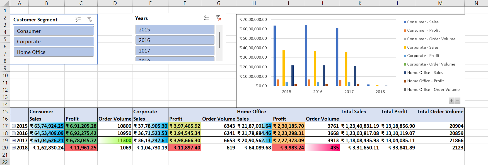

*Logistics Risk Pivot Table*
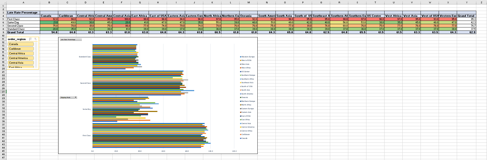

*For Excel Deep Pivot Analysis, kindly check the **Excel Folder**.*

**Digital Demand Analysis**

|**Tool**|**Step**|**Focus Area**|**Deliverable**|
| :--- | ---: |
|**SQL**|Traffic Aggregation|Views by Product, Category, and Department; Top 10 most viewed items|Traffic Summary Table|
|**SQL**|Temporal Analysis|Traffic distribution by Hour of Day and Month|Temporal Traffic Table|
|**Excel**|Visualization|Pivot Charts for top products and hourly demand patterns|Excel Traffic Visuals|

*Traffic Aggregation*
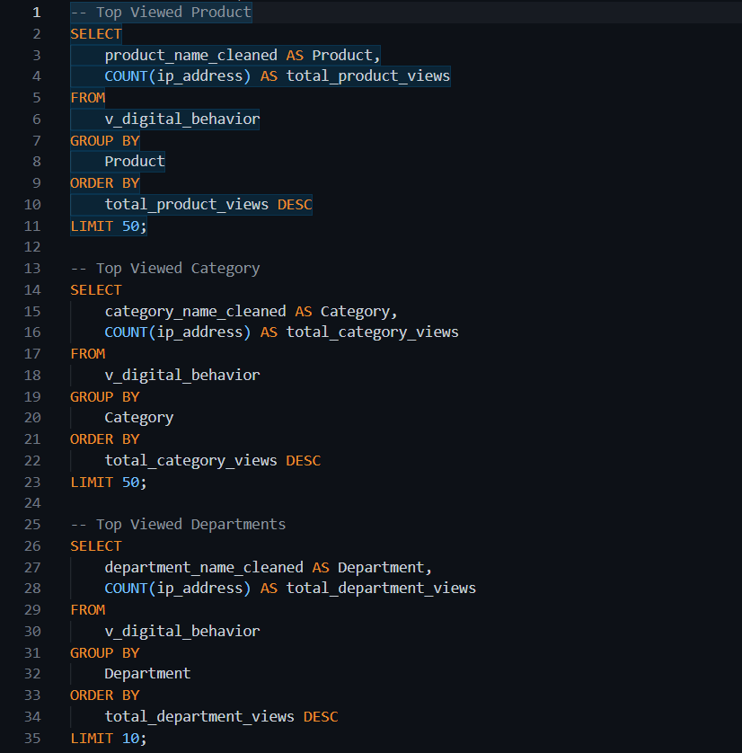

*Temporal Traffic Analysis*
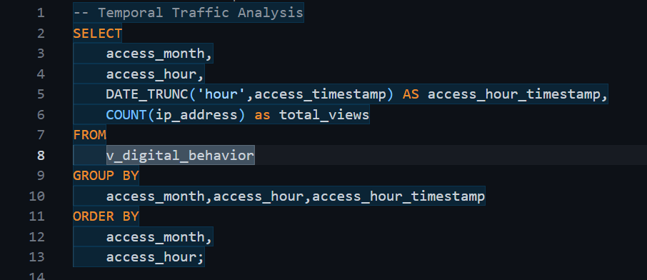

*Pivot Table Overview*

*Digital Traffic Pivot Table*
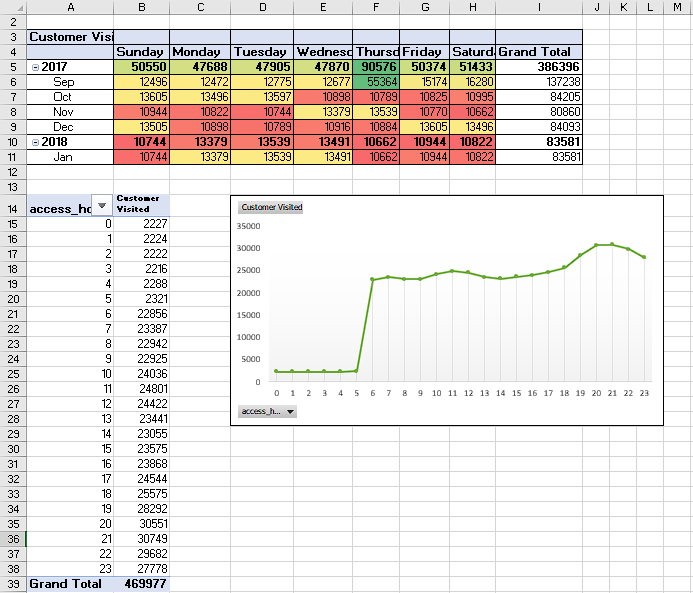

*For Excel Deep Pivot Analysis, kindly check the **Excel Folder**.*

## <u>**Stage 4 – Power BI Data Modelling & Visualization**</u>

Two executive-level dashboards were developed.
**Dashboard 1: Supply Chain Performance & Risk**

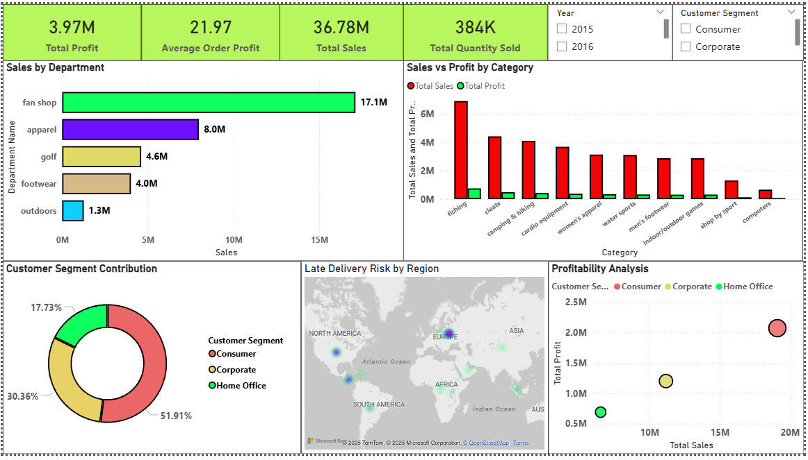

|**Visual**|**Insight**|
| :--- | ---: |
|**Sales by Department**|Fan Shop dominates revenue at **$17.1M**, confirming its strategic importance.|
|**Sales vs. Profit by Category**|Fishing category shows high sales volume but relatively thin margins, indicating cost pressure.|
|**Customer Segment Contribution**|Consumer segment contributes **51.91%** of total revenue and profit.|
|**Late Delivery Risk by Region**|Europe exhibits the highest concentration of late delivery risk globally.|
|**Profitability Overview**|Consumer segment drives the majority of sales and profit, validating its prioritization.|

**Dashboard 2: Digital Demand & Conversion**

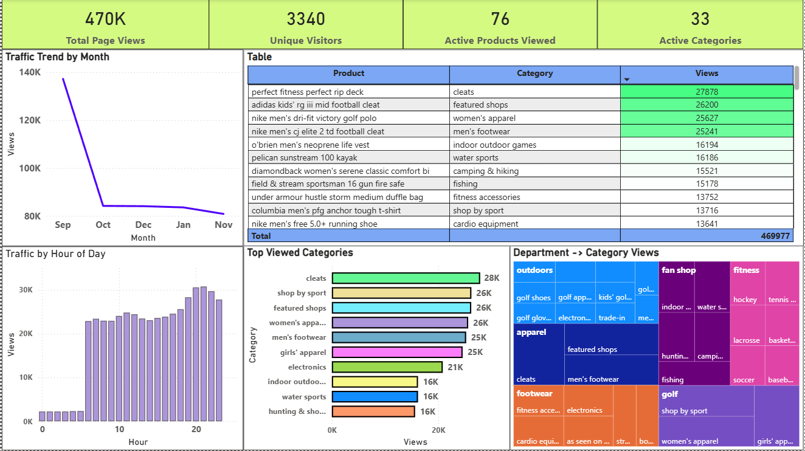

|**Visual**|**Insight**|
|**Monthly Traffic Trend**|Page views decline sharply by **35%+ after September**, signalling demand volatility.|
|**Hourly Traffic Distribution**|Peak demand occurs between **18:00 and 23:00**, defining critical operational hours.|
|**Top Viewed Products & Categories**|Cleats lead with **27.9K views**, indicating strong customer interest.|

## <u>**Stage 5 – Final Insights & Recommendations**</u>

**Key Business Insights**
* **Revenue Concentration Risk:** Profitability is heavily dependent on the Fan Shop department and Consumer customer segment.
* **Geographic Fulfilment Risk:** Europe presents the highest late delivery risk, directly threatening performance in a high-revenue region.
* **Demand Volatility:** The post-September traffic decline reveals a structural weakness in sustained digital demand generation.

**Strategic Recommendations**
*	**Logistics Risk Mitigation:** Prioritize an in-depth review of European fulfillment operations (customs processes, 3PL performance) to reduce delivery delays.
* **Operational Scheduling Optimization:** Restrict system maintenance and non-critical IT activities to low-demand hours (00:00–05:00) to protect peak sales windows (18:00–23:00).
*	**Product Margin Improvement:** Conduct a detailed COGS audit for the Fishing category to enhance margins without sacrificing volume.

### **Note:** *For more details about the project, kindly check the **Project Folders** in this repository* 
4.	Traffic Stabilization Strategy: Initiate a cross-functional Marketing–Inventory review to diagnose the post-September traffic decline and deploy incentive-driven campaigns to stabilize demand year-round.
________________________________________
